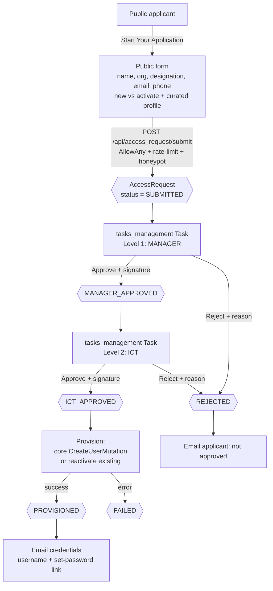

# 00 — Overview, Scope & Phasing

## 1. Objective

Provide a professional **Access Request / Account Provisioning Module** for
TASAF MIS (CoreMIS / openIMIS) that lets a person **without a login** apply for
system access through a public, self-service page — and lets TASAF staff review,
approve, and provision the account through a transparent, signed, two-level
approval workflow.

The module covers two request types:

- **New account** — an applicant with no existing user requests a brand-new account.
- **Account activation** — an applicant with an existing (inactive / locked /
  never-activated) account requests it be (re)activated.

At the end of a successful flow, a `core` interactive user is created (or an
existing one reactivated) and the applicant is **emailed their credentials**.

> The applicant never touches the authenticated openIMIS app. They interact only
> with a public landing page. Everything privileged — role assignment, user
> creation, activation — happens on the staff side, gated by rights and validated
> server-side.

## 2. The user-facing story (from the design)

The public page opens with a hero:

> **Create Your TASAF MIS Account**
> Apply for a new user account or activate your existing account in the TASAF
> Management Information System. Our streamlined process makes it fast and simple.
> **[ Start Your Application → ]   [ Learn More ]**

…followed by a **Simple 3-Step Process** section, three cards:

| # | Card | Meaning |
|---|------|---------|
| 1 | **Submit Your Information** | Applicant provides personal + organizational details (name, organization, designation, email, phone). "All information is kept secure and confidential." |
| 2 | **Get Approvals** | **Manager** and **ICT department** review the request and provide their approval **with signatures**. |
| 3 | **Account Created** | On final approval, the account is created/activated and **the username + password are emailed** to the applicant for secure access. |

This maps 1:1 to the workflow in §5.

### 2.1 The paper form being digitized

The module digitizes the TASAF MIS **"Users Account Application/Activation Form"**.
The public page + approval workflow reproduce it field-for-field:

| Form block | Fields | Captured by |
|------------|--------|-------------|
| **Header toggle** | ☐ New user Creation · ☐ Activation of Existing user | `request_type` (NEW / ACTIVATE) |
| **Requester's Information** (filled by applicant) | Full Name · Organization/PAA · Section · Designation · Email Address · Phone Number · **Signature** | `AccessRequest` fields + applicant signature |
| **Approval from Department/Line Manager** | Name · Title · **Signature** · Date | Generic approval engine step `MANAGER` |
| **Approval from the ICT Department** | Name · Title · **Signature** · Date | Generic approval engine step `ICT` |
| **Footer note** | *"Username approved, and the password will be shared via email"* | Credential delivery on provisioning (set-password link) |

Every signature/stamp on paper becomes a captured digital signature + timestamped
approver identity in the generic approval engine.

## 3. Design principles

1. **openIMIS-native.** Mirror existing custom modules (`training`,
   `communications`, `individual`, `tasaf_payment`). No bespoke frameworks.
2. **Never modify `core`.** `core` (users/roles/rights, `CreateUserMutation`,
   `userServices`) is an installed venv package. This module *calls into* core; it
   does not patch it. User creation/activation happens through core's public API.
3. **UUID + audit + soft delete.** All entities extend
   `core.models.HistoryModel` (UUID PK, `is_deleted`, `version`, `json_ext`,
   `user_created/updated`, `date_created/updated`).
4. **Public surface is untrusted.** The submission endpoint is `AllowAny` with
   **empty `authentication_classes`**, protected by honeypot + per-IP rate limit
   (+ pluggable CAPTCHA). It only *records a request*; it grants nothing.
5. **Privilege can never be self-selected.** Applicants pick a **curated profile**
   (a friendly label), never a raw `core.Role`. Staff map profile → real Role(s)
   at approval, and the server enforces that an approver may only grant roles at or
   below their own authority.
6. **Maker-checker, two levels, signed.** Approval flows through the generic
   approval engine with two sequential approval stages — Manager, then ICT — each
   recording an approver identity + signature + timestamp.
7. **Configurable, not hardcoded.** Curated profiles, profile→role map, approval
   levels, and email templates live in DB / module config (`core.ModuleConfiguration`),
   never only in the frontend.
8. **Don't break existing modules.** Additive only: new BE app + new FE module +
   two registration edits (`openimis.json`, `modules-requirements.txt`).

## 4. Scope — Phase 1 (build now)

| Area | Phase 1 deliverable |
|------|---------------------|
| Public landing page | Hero + "Simple 3-Step Process" cards + "Start Your Application" wizard, unauthenticated route |
| Application form | Personal + organizational details; new-account vs activate-existing toggle; curated profile + region/district scope; CAPTCHA/honeypot |
| Public submit endpoint | `AllowAny` DRF endpoint, rate-limited, honeypot, no data leakage; creates `AccessRequest` (status `SUBMITTED`) |
| `AccessRequest` entity | HistoryModel: applicant identity, org/designation, contact, request type, requested profile, requested scope, status, links to created user |
| Curated profiles | `AccessProfile` (config-driven) mapping a friendly label → suggested `core.Role`(s) |
| Two-level approval | `tasks_management` tasks: Level 1 **Manager** → Level 2 **ICT**; each records approver + signature; reject with reason at either level |
| Provisioning | On final approval: create `core` interactive user (or reactivate existing) with confirmed Role(s) + district scope; store back-link |
| Credential delivery | Email username + set-password link/temporary password to applicant on success |
| Admin review UI | Authenticated React page — Searcher + Contributions tabs; list/filter, open, map profile→Role, approve/reject at each level |
| Status tracking | `SUBMITTED → MANAGER_APPROVED → ICT_APPROVED → PROVISIONED` / `REJECTED` / `FAILED` |
| Applicant status check | Optional public "check my request status" via reference code |
| Permissions | `23xxxx` rights, role-gated menus/routes for the staff side |
| Notifications | Email to applicant on submit-received / approved / rejected; email to next approver on hand-off |

## 5. Approval workflow

## 6. Entities (Phase 1)

| Entity | Purpose |
|--------|---------|
| `AccessRequest` | The application itself, mirroring the paper form's Requester block: `request_type` (NEW / ACTIVATE), `full_name`, `organization_paa`, `section`, `designation`, `email`, `phone`, `applicant_signature`; plus requested `AccessProfile`; requested region/district/location scope; `status`; `reference_code`; FK to the created/activated `core` user; `json_ext`. |
| `AccessProfile` | Curated, config-driven label the public sees (e.g. "District Data Entry"). Holds the **suggested** `core.Role`(s) and default scope. Only *pre-fills* the approver's choice. |
| Approval engine records | The Manager and ICT approval blocks are stored as `ApprovalRequest`, `ApprovalStep`, and `ApprovalDecision` rows in `openimis-be-approval_py`. |

All extend `HistoryModel`.

## 7. Permissions (`23xxxx`)

`access_request` is module **23** (after `training`=21, `communications`=22).
Rights follow the `2301xx` grouping convention:

| Right | Meaning |
|-------|---------|
| *(none)* | **Submit** a request — public `AllowAny`, no right required |
| `230101` | Search / view access requests (staff) |
| `230102` | View request detail |
| `230201` | Level-1 **Manager** approve / reject |
| `230202` | Level-2 **ICT** approve / reject *(and holds core user-create right)* |
| `230301` | Manage curated profiles & profile→role mapping (config) |

The provisioning step additionally requires the approver to hold core's
user-management right; the module verifies this before calling
`CreateUserMutation`.

## 8. Security guardrails (public surface)

- **AllowAny + empty `authentication_classes`** on the submit view only.
- **Per-IP rate limit** + **honeypot field** (silently accept bots), pluggable
  **CAPTCHA** (Turnstile / hCaptcha) — same pattern as the Training QR check-in.
- **No enumeration:** never confirm whether an email/username already exists; the
  ACTIVATE path resolves the existing user server-side at approval time, not on the
  public form.
- **No privilege self-selection:** curated profiles only; final Role(s) chosen by
  staff and validated against the approver's own authority server-side.
- **Nothing is granted on submit** — a request is inert until two humans approve.

## 9. Scope — Phase 2 (design only, do **not** implement now)

Bulk/CSV requests, delegated approver routing by region, SLA reminders/escalation,
applicant self-service profile edits, integration with an external HR directory,
digital-signature certificates (PKI) instead of drawn signatures, audit export /
compliance report, and account-deactivation ("offboarding") requests.

Extension points that keep Phase 2 non-breaking: `json_ext` on every entity,
nullable/extra approval levels via a configurable `approval_levels` list, and a
status model that already distinguishes `PROVISIONED`/`FAILED`.

## 10. Registration & footprint

Additive only:

- **BE:** new `openimis-be-access_request_py` app; add to
  `modules-requirements.txt`.
- **FE:** new `openimis-fe-access_request_js` module; register in
  `openimis-fe_js/openimis.json`.
- **Public route:** unauthenticated FE route + backend `AllowAny` endpoint,
  mounted like the Training check-in.

## 11. Glossary

| Term | Meaning |
|------|---------|
| **Curated profile** | Friendly access label the public picks; maps to real `core.Role`(s) that only staff confirm |
| **Two-level approval** | Sequential Manager → ICT sign-off via `tasks_management` |
| **Provisioning** | Creating (or reactivating) the `core` interactive user + assigning Role(s)/scope |
| **Maker-checker** | openIMIS `tasks_management` approval pattern |
| **`HistoryModel`** | openIMIS core base model: UUID PK + history + soft delete + audit |
| **Enumeration** | Probing a public form to learn which emails/usernames exist — explicitly prevented here |
